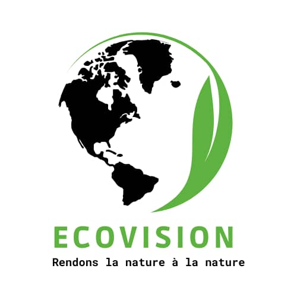

# EcoVision_PAS_2023
# Projet Forest Innovation

## Équipe

L'équipe Ecovision est dédiée à la préservation de l'environnement et à l'innovation technologique au Sénégal. 

## Objectif
Le projet Forest Innovation vise à aborder la problématique de la surveillance de l'activité carbone dans les forêts sénégalaises en utilisant des données satellitaires et l'intelligence artificielle. Notre objectif principal est de développer des modèles de segmentation d'image pour identifier les zones forestières dans des images satellites.

## Aperçu

L'initiative Forest Innovation est centrée sur l'utilisation de l'IA pour analyser les données satellitaires et cartographier les zones forestières, contribuant ainsi à la préservation des forêts sénégalaises et à la surveillance de l'activité carbone. Notre équipe, Ecovision, a développé un modèle de segmentation d'image basé sur Unet pour prédire les masques de ces zones forestières.

## Fonctionnalités

- Modèle Unet pour la segmentation d'images.
- Prédiction de masques pour les zones forestières dans des images de 512x512 pixels.

## Comment ça marche

1. **Collecte de données** : Nous avons rassemblé un jeu de données d'images satellitaires étiquetées pour l'entraînement de notre modèle.

2. **Entraînement du modèle** : Nous avons utilisé le modèle Unet pour l'apprentissage supervisé. Le modèle a été entraîné sur des images de 512x512 pixels avec leurs masques correspondants.

3. **Prédiction** : Une fois le modèle entraîné, il peut être utilisé pour prédire les masques des zones forestières dans de nouvelles images satellitaires.

## Interface

Pour utiliser notre modèle et explorer ses fonctionnalités, veuillez accéder à notre interface conviviale en ligne [ici](https://github.com/EcovisionSN/EcoVision_Django_Interface "lien github de l'interface").

## Échelle de mesure

Notre modèle est capable d'identifier le taux de couvert forestier, la capacité d'absorption de carbone d'une zone, ainsi que le nombre d'arbres dans une zone forestière. Pour ce faire, nous avons établi une échelle de mesure basée sur les éléments dans l'image, comme expliqué précédemment.

1. **Taux de couvert forestier** : Le modèle évalue le pourcentage de la zone de l'image couverte par la forêt, fournissant ainsi une mesure du couvert forestier dans la zone.

2. **Capacité d'absorption de carbone** : En utilisant la mesure du taux de couvert forestier et l'échelle de mesure que nous avons définie (1,5 px/m), le modèle calcule la capacité d'absorption de carbone de la zone. Cette capacité est un indicateur clé de l'impact environnemental de la zone.

3. **Nombre d'arbres** : En plus des deux mesures précédentes, le modèle est également capable de déterminer le nombre d'arbres dans la zone forestière, ce qui est essentiel pour la gestion et la conservation des forêts.

Ces informations permettent une analyse approfondie de la zone forestière, contribuant ainsi à la surveillance et à la prise de décisions éclairées pour la préservation de l'environnement.

## NB
> La branche main contient la version finale du prototype, et la branche dev l'ensemble des expérimentation faites pour aboutir au modèle actuel.
